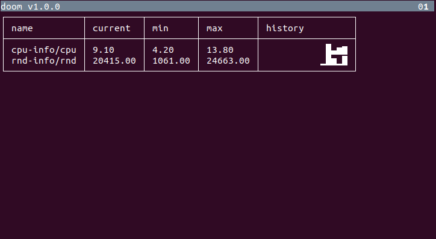

# doomsday-metrics

A way to collect and display system metrics in the terminal when all other monitoring systems are down.

## Preview



## Usage

- Download and extract [the executable](https://github.com/gchudnov/doomsday-metrics/releases).
- Prepare http-queries or shell scripts that extract metrics.
- Prepare a JSON-file with configuration that are using the created html query or shell scripts.
- Run application from the command line:

```bash
./doom ./path-to-config.json
```

## Command-line parameters

```text
./doom --help

doom 1.0.0
Usage: doom [options] <probe-file>

  --help        prints this usage text.
  --version
  --debug       debug mode.
  <probe-file>  path to json probe configuration.
```

Here `<probe-file>` is a path to JSON-file that contains [probes and queries](#Probes-and-Queries).

## Probes and Queries

To run the application it is required to provide a JSON-file with configuration.
Configuration contains a collection of *probes* and *queries* inside of each probe.

An example configuration might look like this:

```json
[
  {
    "type": "shell",
    "name": "cpu-info",
    "cmd": "./cpu-info.sh",
    "interval": "5s",
    "queries": [
      {
        "type": "text",
        "name": "cpu",
        "textPath": "",
        "valueType": "double"
      }
    ]
  },
  {
    "type": "http",
    "name": "date-time",
    "url": "http://date.jsontest.com/",
    "interval": "10s",
    "queries": [
      {
        "type": "json",
        "name": "time",
        "jsonPath": "$.time",
        "valueType": "string"
      },
      {
        "type": "json",
        "name": "milliseconds_since_epoch",
        "jsonPath": "$.milliseconds_since_epoch",
        "valueType": "long"
      }
    ]
  }
]
```

In this example we we have 2 probes, `http` and `shell` that run every 5 and 10 seconds.
Shell Probe runs a script that extracts CPU usage as text. The text value is extracted using the provided query with the name `cpu`.

An HTTP probe calls `http://date.jsontest.com/` every 10 seconds that returns JSON. The response is later analyzed with two queries: one query fetches time as a string and the second fetches millisecons as a long value.

More examples can be found in the [examples](examples/) directory.

### Probe
 
A *Probe* represents an action to run to get the metrics data.
Application supports 2 types of probes: [http](#HTTP-Probe) and [shell](#Shell-Probe)

#### HTTP-Probe

An Http Probe allows to make http(s) requests and extract data from the results.

```json
  {
    "type": "http",
    "name": "date-time",
    "url": "http://date.jsontest.com/",
    "interval": "5s",
    "queries": [
    ]
  }
```

- **type** - type of the probe. must be `http` for an http(s) probe.
- **name** - name of the probe. A name for all probes in the file must be unique.
- **url** - url to access to extract data that will be processed using the provided queries.
- **interval** - run interval, e.g. `5s` for *5 second interval* between url requests.
- **queries** - a collection of [queries](#Queries) used to extract data from the *http-response*.

#### Shell-Probe

A Shell Probe allows to run a command-line executable or a script that returns data in stdout.
The returned data can be processed by queries specified in the probe.

```json
  {
    "type": "shell",
    "name": "rnd-info",
    "cmd": "./random.sh",
    "interval": "5s",
    "queries": [
    ]
  }
```

- **type** - type of the probe. must be `shell` for a shell probe.
- **name** - name of the probe. A name for all probes in the file must be unique.
- **cmd** - command to run. After execution, *stdout* will be consumed and processed using the provided queries.
- **interval** - run interval, e.g. `5s` for *5 second interval* between command execution.
- **queries** - a collection of [queries](#Queries) used to extract data from *stdout*.

## Queries

Each probe should contain a collection of queries to extract data from the response.
Application supports 3 types of queries: [csv](CSV-Queries), [json](JSON-Queries) and [text](#TEXT-Queries).

### CSV-Queries

### JSON-Queries

### TEXT-Queries

## Building

To build an executable, run the following sbt-task:

```sbt
doom/assembly
```

The executable will be created in './target' directory.

## Contact

[Grigorii Chudnov] (mailto:g.chudnov@gmail.com)


## License

Distributed under the [The MIT License (MIT)](LICENSE).
