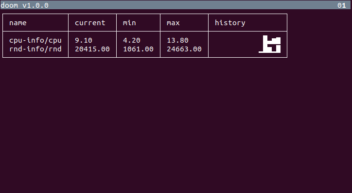

# doomsday-metrics

Collecting and displaying system metrics in the terminal.


## Preview



## Usage

- Download and extract [the executable](https://github.com/gchudnov/doomsday-metrics/releases) or [build](#Building) it.
- Prepare http- requests and shell scripts that extract metrics from a target system.
- Prepare a JSON-file with configuration to run the created requests and parse the results.
- Run application from the command line:

```bash
./doom ./path-to-probe-file.json
```

After execution, a full-screen terminal window will be displayed with the extracted data. All metrics will be refreshed according to the intervals specified in `./path-to-probe-file.json`.

Keyboard keys `[0] - [9]` can be used to switch pages with the output if the amount of the observed values is too high for one page.
A special page `0` is used to report errors in queries.

## Command-line parameters

```text
./doom --help

doom 1.0.0
Usage: doom [options] <probe-file>

  --help        prints this usage text.
  --version
  --debug       debug mode.
  <probe-file>  path to json probe configuration.
```

Here `<probe-file>` is a path to JSON-file that contains [probes and queries](#Probes-and-Queries).

## Probes and Queries

It is required to provide a JSON-file (<probe-file>`) with configuration for the application.
Configuration contains a collection of *probes* and the related *queries*.

An example configuration might look like this:

```json
[
  {
    "type": "shell",
    "name": "cpu-info",
    "cmd": "./cpu-info.sh",
    "interval": "5s",
    "queries": [
      {
        "type": "text",
        "name": "cpu",
        "textPath": "",
        "valueType": "double"
      }
    ]
  },
  {
    "type": "http",
    "name": "date-time",
    "url": "http://date.jsontest.com/",
    "interval": "10s",
    "queries": [
      {
        "type": "json",
        "name": "time",
        "jsonPath": "$.time",
        "valueType": "string"
      },
      {
        "type": "json",
        "name": "milliseconds_since_epoch",
        "jsonPath": "$.milliseconds_since_epoch",
        "valueType": "long"
      }
    ]
  }
]
```

In this example we we have two probes, `http` and `shell` that run every 5 and every 10 seconds respectively.

The provided *shell probe* runs a script that extracts CPU usage as text. The returned text is parsed by a query as a double value.

The HTTP probe calls `http://date.jsontest.com/` every 10 seconds and returns JSON-response. The response is later analyzed with two queries: the first query extracts 'time'-field as a string and the second one extracts 'millisecons'-field as a long value.

More examples can be found in the [examples](examples/) directory.

### Probe

A *Probe* represents an action to run to provide one or more values as text, csv or json.
Application supports 2 types of probes: an [http](#HTTP-Probe) and a [shell](#Shell-Probe) probe.

#### HTTP-Probe

An Http Probe allows to make http(s) requests to a remote host.
The returned data can be processed by queries specified in this probe.

```json
{
  "type": "http",
  "name": "date-time",
  "url": "http://date.jsontest.com/",
  "interval": "5s",
  "queries": [
  ]
}
```

- **type** - type of the probe. Must be `http` for an http(s) probe.
- **name** - name of the probe. Probe names must be unique within the configuration file.
- **url** - http(s) url to access.
- **interval** - run interval, e.g. `5s` to make a http(s) request every 5 seconds.
- **queries** - a collection of [queries](#Queries) used to extract data from the *http-response*.

#### Shell-Probe

A Shell Probe allows to run a command-line executable or a script that returns data in stdout.
The returned data can be processed by queries specified in this probe.

```json
{
  "type": "shell",
  "name": "rnd-info",
  "cmd": "./random.sh",
  "interval": "5s",
  "queries": [
  ]
}
```

- **type** - type of the probe. Must be `shell` for a shell probe.
- **name** - name of the probe. Probe names must be unique within the configuration file.
- **cmd** - command to run.
- **interval** - run interval, e.g. `5s` to run the command every 5 seconds.
- **queries** - a collection of [queries](#Queries) used to extract data from *stdout*.

## Queries

Each probe should contain a collection of queries to extract one or more values from the response.
If no queries are provided, the data is discarded and nothing is displayed on the screen.
Application supports 3 types of queries: [csv](#CSV-Queries), [json](#JSON-Queries) and [text](#TEXT-Queries).

One query extracts only one value.

### CSV-Queries

A CSV-Query allows to analyze data returned in a CSV-format and extract the value from one of the cells.

```json
{
  "type": "csv",
  "name": "csv-query",
  "csvPath": "name=as.node.ignore.left.demand;name",
  "separator": ";",
  "valueType": "string"
}
```

- **type** - type of the query. Must be `csv` for a CSV-Query.
- **name** - name of the query. All queries within the same probe should have the unique names.
- **csvPath** - [path](#CSV-Path) to the cell to extract the value.
- **separator** - separator used in CSV, e.g. ';'.
- **valueType** - [type](#Value-Types) of the value in the cell.

#### CSV-Path

A CSV-path has the following syntax:

```text
C1=V1;C2
```

it translates to the following actions:

1. select a column named C1.
2. inside of the selected column C1, find a row R where the value equals to 'V1'.
3. given row R, select the cell in the column C2. That is the value returned from the query.

### JSON-Queries

A JSON-Query allows to use [JSONPath](https://goessner.net/articles/JsonPath/) syntax to extract a value from a JSON-document.

```json
{
  "type": "json",
  "name": "json-query",
  "jsonPath": "$.gauges.['threadStates.deadlock.count'].value",
  "valueType": "double"
}
```

- **type** - type of the query. Must be `json` for a JSON-Query.
- **name** - name of the query. All queries within the same probe should have the unique names.
- **jsonPath** - [JSONPath](https://goessner.net/articles/JsonPath/) to extract the field.
- **valueType** - [type](#Value-Types) of the extracted value.

### TEXT-Queries

Text query allows to use a regular expression to extract one value from a text returned in a probe.

```json
{
  "type": "text",
  "name": "text-query",
  "textPath": "123",
  "valueType": "big-decimal"
}
```

- **type** - type of the query. Must be `text` for a TEXT-Query.
- **name** - name of the query. All queries within the same probe should have the unique names.
- **textPath** - Regular expression to fetch one value from the text. If no value is provided the whole text is returned as a value.
- **valueType** - [type](#Value-Types) of the extracted value.

## Value Types

Define the type of the extracted value in a query. The set of the supported data types include: a `string`, `double`, `long`, `boolean`, `big-decimal` and `date-time`.

- **string** - any text value.
- **double** - a double-precision 64-bit IEEE 754 floating point.
- **long** - a 64-bit signed integer data type. The range is from -2^63 to 2^63-1.
- **boolean** - a value that can take two values: `true` or `false`.
- **big-decimal** - represents an arbitrary-precision signed decimal numbers.
- **date-time** - a text value such as "2020-10-10T09:12:17+02:00" that represents data and time with a time zone.

If the value cannot be converted to the specified type, an error will be generated.

## Building

To build an executable, run the following sbt-task:

```sbt
client/assembly
```

The executable will be created in './target' directory.

## Contact

[Grigorii Chudnov] (mailto:g.chudnov@gmail.com)

## License

Distributed under the [The MIT License (MIT)](LICENSE).
